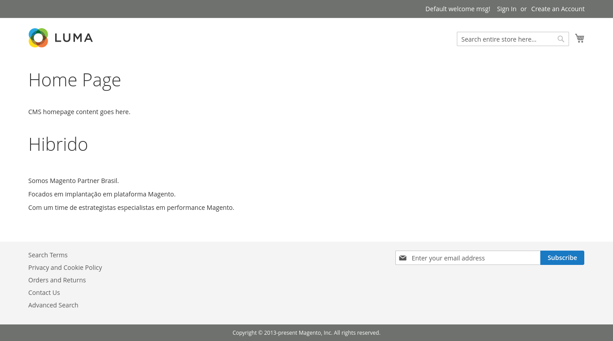
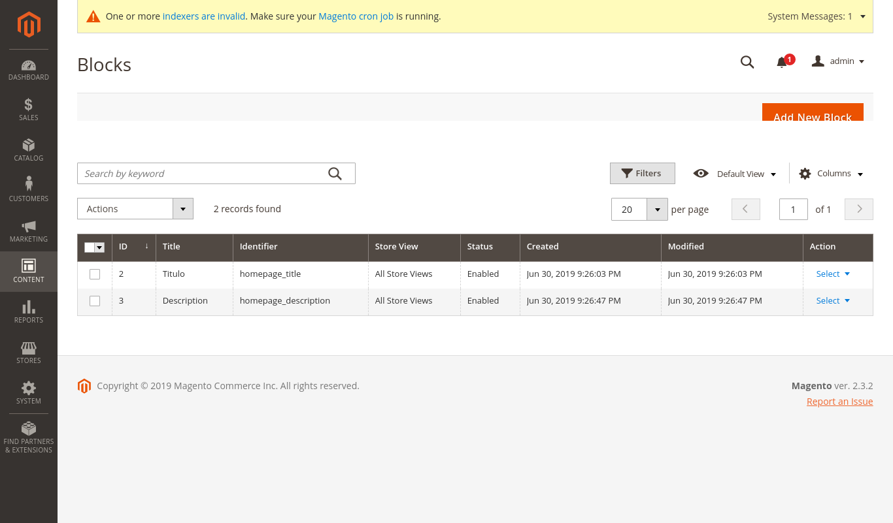
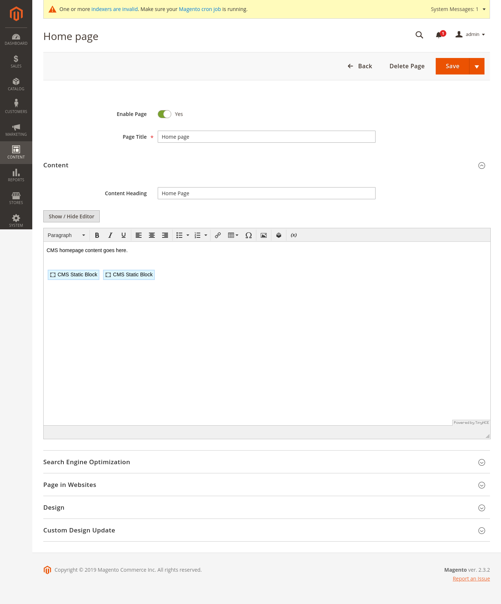
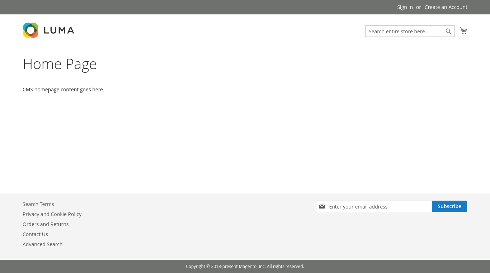

# Instalação do Magento 2.3.2
 
E necessário que clone este repositorio, certifique-se que em seu diretório de instalação já existe um diretório com o nome magento2
 
## Instalação
 
### Clonar repositório
```
$ git clone https://github.com/MaickSilva/magento2.git
```
 
Em seguida entre no diretório
```
$ cd magento2
```
 
### Composer Install
 
Após clonar certifique-se de entrar no diretório baixado
 
```
$ composer install
```
 
 
### Permissões
 
Vamos dar permissões as pastas do nosso projeto
 
```
$ sudo chown -R :www-data .
$ sudo find var generated vendor pub/static pub/media app/etc -type f -exec chmod g+w {} +
$ sudo find var generated vendor pub/static pub/media app/etc -type d -exec chmod g+ws {} +
```
 
Em seguida você pode entrar na url que você definiu no seu servidor para acessar, deve abrir normalmente na tela de setup, mas eu irei instalar via linha de código
 
### Banco de dados via CLI
 
Você pode criar um banco de dados e um novo usuário para fazer a instalação, no caso estou disponibilizando um sql para que seu banco possa ficar igual ao meu contento meu bloco personalizado
[Minha database atual](https://drive.google.com/file/d/1RxhM2JOzwfFDcXMsXE92aGChEagNAoIb/view).

Obs: vou disponibilizar um arquivo no qual você deve criar dentro do diretório ```<directory>app/etc/```

Você irá criar o arquivo chamado ```env.php``` e inserir o código abaixo alterando os parâmetros para os seus

Obs: pode ser que você precise alterar as permissões para criar o arquivo, ou entrar como sudo, pois já foi estabelecidos o grupo de usuario.

```
<?php
return [
    'backend' => [
        'frontName' => 'admin'
    ],
    'crypt' => [
        'key' => 'f92d9148a10b89d99f97a60e5e344d4d'
    ],
    'db' => [
        'table_prefix' => '',
        'connection' => [
            'default' => [
                'host' => 'localhost',
                'dbname' => 'magento',
                'username' => 'user',
                'password' => 'magento',
                'model' => 'mysql4',
                'engine' => 'innodb',
                'initStatements' => 'SET NAMES utf8;',
                'active' => '1'
            ]
        ]
    ],
    'resource' => [
        'default_setup' => [
            'connection' => 'default'
        ]
    ],
    'x-frame-options' => 'SAMEORIGIN',
    'MAGE_MODE' => 'default',
    'session' => [
        'save' => 'files'
    ],
    'cache' => [
        'frontend' => [
            'default' => [
                'id_prefix' => '4cf_'
            ],
            'page_cache' => [
                'id_prefix' => '4cf_'
            ]
        ]
    ],
    'lock' => [
        'provider' => 'db',
        'config' => [
            'prefix' => NULL
        ]
    ],
    'cache_types' => [
        'config' => 1,
        'layout' => 1,
        'block_html' => 1,
        'collections' => 1,
        'reflection' => 1,
        'db_ddl' => 1,
        'compiled_config' => 1,
        'eav' => 1,
        'customer_notification' => 1,
        'config_integration' => 1,
        'config_integration_api' => 1,
        'full_page' => 1,
        'config_webservice' => 1,
        'translate' => 1,
        'vertex' => 1
    ],
    'install' => [
        'date' => 'Sun, 30 Jun 2019 09:13:03 +0000'
    ]
];


```

Após isso você precisará alterar a URL dentro do seu banco de dados, procure pela tabela core_config_data 
```
core_config_data -> web/unsecure/base_url -> Alterar o campo para sua URL 
```
[Exemplo do que alterar](https://magento.stackexchange.com/questions/39752/how-do-i-fix-my-base-urls-so-i-can-access-my-magento-site)

Depois de alterar você precisa limpar o cache
```
$ sudo bin/magento setup:upgrade && bin/magento cache:clean && bin/magento cache:flush
```

## Se você seguiu todos os passos e está utilizando o banco que disponibilizei você deve estar vendo algo parecido com isso:
 



## Dentro do ADMIN indo até Content > Blocks, você irá encontrar algo como isso:


 
 
 
 
## Indo até Content > Pages > Home Page e indo em editar você irá ver algo assim:


 

# Não utilizando o banco de dados disponibilizado acima você pode fazer a instalação normalmente via CLI.

Muita atenção abaixo, você precisa inserir com muita atenção as informações para que seja feito a conexão sem problemas.
os principais campos para observação são: `--base-url`,`--db-host`,`--db-name`,`--db-user` e `--db-password`
```
$ sudo bin/magento setup:install \
--base-url=http://local.magento2.com \
--db-host=localhost \
--db-name=magento_gh \
--db-user=user_magento \
--db-password=magento \
--backend-frontname=admin \
--admin-firstname=admin \
--admin-lastname=admin \
--admin-email=admin@admin.com \
--admin-user=admin \
--admin-password=admin123 \
--language=pt_BR \
--currency=BRL \
--timezone=America/Sao_Paulo \
--use-rewrites=1 
```
 
## Após a instalação você deve ver algo assim: 


 
 
## Links de ajuda
### Instalação completa seguindo estes passos do readme 

Clique na imagem para assistir o vídeo.

<a href="http://www.youtube.com/watch?feature=player_embedded&v=VAtoP3KY6LA" target="_blank">
 </a>

### Instalação via composer seguindo a documentação do magento (Vídeo feito por mim)
[Instalação via composer](https://streamable.com/mhwrf).
 
### Documentação do Magento 
[Install Magento using Composer](https://devdocs.magento.com/guides/v2.3/install-gde/composer.html).

